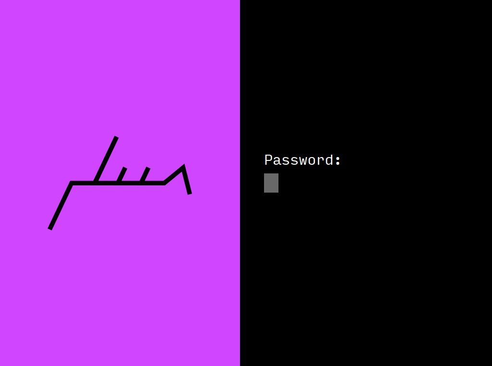

# the buzzert screen locker

This is a graphical screen locker for X11, for use in conjunction with 
[XSecureLock](https://github.com/google/xsecurelock). It uses PAM for authentication,
so you can use it with your Yubikey/fingerprint scanner, etc. as well.



## Building

This project uses the Meson build system:


```
meson build
ninja -C build
```

## Installing
By building buzzlocker by itself, you'll end up with a binary called `auth_buzzlocker`.
This is meant to be used in conjunction with [XSecureLock](https://github.com/google/xsecurelock), 
which does all the heavy-lifting with regards to properly locking an X session and ensuring other 
windows cannot steal focus or cause the locker to disappear somehow. It also handles secure keyboard
input to make sure key events don't get delivered to applications in the background.

If you run `auth_buzzlocker` by itself, you can preview what the screen locker looks
like in windowed-form. If you want to use buzzlocker as your screen locker with XSecureLock,
all you need to do is set the `XSECURELOCK_AUTH` environment variable to point to `auth_buzzlocker`.

So you might want to do:
1. `sudo ninja -C build install`
2. `XSECURELOCK_AUTH=/usr/local/bin/auth_buzzlocker xsecurelock`

If you want to make it permanent, edit `/etc/environment` to include this line:
```
XSECURELOCK_AUTH=/usr/local/bin/auth_buzzlocker xsecurelock
```

So every time you run `xsecurelock` by itself, it will use buzzlocker as the GUI.


